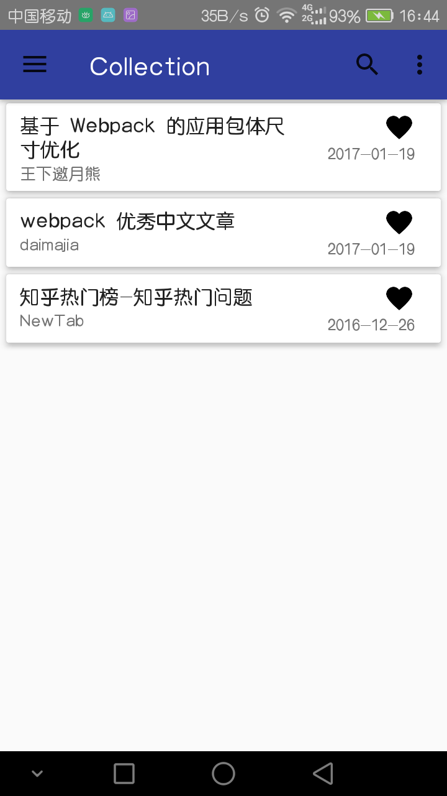

## GankIO
This is an android application which provides the IT articles from [干货](http://gank.io).

## Declaration
Some icons belong to [icons8](https://icons8.com).
All the data(Articles) are from [干货](http://gank.io).   

## Demo Pictures

## License
Copyright @2017 By WEI,Xikai  
 
Licensed under the Apache License, Version 2.0 (the "License");
you may not use this file except in compliance with the License.
You may obtain a copy of the License at

    http://www.apache.org/licenses/LICENSE-2.0

Unless required by applicable law or agreed to in writing, software
distributed under the License is distributed on an "AS IS" BASIS,
WITHOUT WARRANTIES OR CONDITIONS OF ANY KIND, either express or implied.
See the License for the specific language governing permissions and
limitations under the License.
